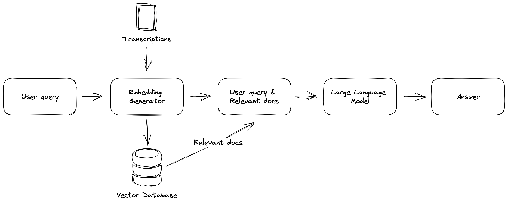

Finding information in your own documents quickly is a crucial task for many people, particularly for those large amounts of information in their documents. Using a vector databases in combination with an LLMs, finding relevant information and answers to your questions becomes a little easier and more efficient.

In this article I build product that allows me to ask questions about topics discussed in the [TrueAnon](https://soundcloud.com/trueanonpod) podcast.



My goal is to search and ask questions about things being shared and discussed in the podcast using natural language. Giving answers to my questions and also providing the sources on which this answer is based.

::: {.column-margin}
The project I build here is inspired by [Aleksa Gordić](https://www.linkedin.com/in/aleksagordic/) and his [Huberman Transcript](https://www.hubermantranscripts.com/) project.
:::

To do all of this we need to build the components in the diagram displayed above. This includes:

1. [Gathering the data](#gathering-podcast-audio-data)
2. [Transcribing podcast episode audio files](#transcription-of-podcast-episodes)
3. [Building a vector database of transcriptions.](#vector-database-of-transcriptions)
4. [Using LLM to get answer to question based and relevant documents.](#answering-questions-based-upon-most-relevant-documents)

## Gathering Podcast Audio Data

Let's start with downloading all podcast episodes of [TrueAnon](https://soundcloud.com/trueanonpod) as audio files.

I did is by parsing the podcasts [RSS feed](https://feeds.soundcloud.com/users/soundcloud:users:672423809/sounds.rss) and extracting the title and the url to the audio recording of every podcast episode and storing them into a dataframe.

```python
import pandas as pd


def get_all_episodes_df(url: str) -> pd.DataFrame:
    # Request RRS feed
    response = requests.get(url)

    # Parse using BeautifulSoup
    soup = BeautifulSoup(response.content, "xml")

    # Extract raw link to audio files
    audio_files = [link["url"] for link in soup.find_all("enclosure")]

    # Find the episode titles
    titles = [title.text for title in soup.find_all("title")][2:]

    # Build data frame of episode titles and audio links
    df = pd.DataFrame({"title": titles, "url": audio_files}).iloc[::-1]

    return df.reset_index(drop=True)
```

Now that we have all the episode titles and audio file urls we make a requests to fetch all the audio files and save them to disk or a storage account using the episode name.

::: {.column-margin}
You can write some logic to skip the episodes you already downloaded.
:::

```python
def download_podcast(url: str, name: str, output_path: str = "") -> None:
    # request to audio file
    response = requests.get(url)

    # Output path to save audio file
    path = Path(output_path)

    # Create directory if not exist
    if not path.exists():
        path.mkdir()
    
    # Create full path to
    output_path = output_path + name + ".mp3"

    # Write file to directory
    with open(output_path, "wb") as fp:
        fp.write(response.content)
```

The function can use the above function to loop over all the audio file urls and persist them to disk.

```python
df = pd.read_csv("...")

for episode_number in range(len(df)):

    # Extract url and title
    url = df.iloc[episode_number]["url"]
    title = df.iloc[episode_number]["title"]

    # Persist audio files
    download_podcast(url, title, output_path = f"audio/")
```

We now have a directory containing all podcast episode audio files.

## Transcription of Podcast Episodes

Before we can build or vector database we need transcriptions.

One of the best ways to extract text from audio files is to use an automatic transcription tool. OpenAI [whisper](https://github.com/openai/whisper) is a model that converts spoken words into text. This model is pretty accurate and can transcribe audio relatively fast (especially when using a GPU).

::: {.column-margin}
Experiment with model sizes. Sometimes smaller model are good enough.
:::

```python
import whisper
from whisper.model import Whisper

model = whisper.load_model("tiny")
audio_files = glob("audio/*.mp3")


def transcribe_podcast(model: Whisper, audio_file_path: str) -> None:

    # Create directory if not exist
    if not Path("transcriptions/").exists():
        Path("transcriptions/").mkdir()

    # Transcribe the recording using whisper
    result = model.transcribe(audio_file_path, language="en")
    
    # Extract the episode name
    audio_file_name = audio_file_path.split('/')[-1]

    # Save transcription to disk
    with open(f"transcriptions/{audio_file_name.split('.mp3')[0]}.txt", "w") as fp:
        fp.write(result["text"].strip())

```

Transcribing a large amount of audio files can take a long time.

```python
# Transcribe every episode
for audio_file in audio_files:
    transcribe_podcast(model, audio_file)
```

Once you have transcribed your videos, you will have a large set of written documents that can be used for further analysis.

## Vector Database of Transcriptions

Once you have transcribed your audio files, the next step is to create a vector database. A vector database is a mathematical representation of your documents that can be used to search for similarities between them.

::: {.column-margin}
**Chunk** - Language models face limitations due to the text volume they can process at once, making it essential to divide them into smaller sections.
:::

I load the transcriptions into a [langchain](https://python.langchain.com/en/latest/) document using the `TextLoader`. After which I use the `RecursiveCharacterTextSplitter` to split the documents into chunks.

```python
from glob import glob
from langchain.document_loaders import TextLoader

# Get all the transcription text files
transcription_text_paths = glob("transcriptions/*.txt")

# Load text files using the TextLoader
documents = [TextLoader(text).load()[0] for text in transcription_text_paths]

# Create text splitter to split documents into chunks
text_splitter = RecursiveCharacterTextSplitter(chunk_size=1000, chunk_overlap=100)

# Split documents into chunks
docs = text_splitter.split_documents(documents)
```

To create a vector database, you will need to convert your written documents into numerical vectors.

In this project I used `HuggingFaceEmbeddings` from [langchain](https://python.langchain.com/en/latest/) (wrapper for [HuggingFace Embeddings/Models](https://huggingface.co/models)) to create embeddings for the episode transcriptions storing them into a `FAISS` vector database.

```python
from langchain.embeddings import HuggingFaceEmbeddings
from langchain.vectorstores import FAISS

# Use HuggingFaceEmbeddings vectorize our documents
embeddings = HuggingFaceEmbeddings()

# Use FAISS to build a vector database and save to disk
vectorstore = FAISS.from_documents(docs, embeddings)
vectorstore.save_local("vectorstore")
```

::: {.column-margin}
Building a initial vector database can take a long time depending on the amount of documents. However, you add/merge a new documents to your existing database.
:::

Now that you have a vector database, you can use it to search for documents that are most relevant to your question.

::: {.column-margin}
To do this, you will need to convert your question into a vector. Once you have your question vector, you can compare it to the vectors in the database and find the documents that are most similar using similarity measures, such as cosine similarity.
:::

```python
query = "How did Jeffrey Epstein get his money?"
vectorstore.similarity_search(query)
```

These functionality is baked into the `FAISS` wrapper in langchain. So we can run a query against the vector database and get the most relevant documents based on the question.

## Answering Questions based upon most Relevant Documents

Now that you have the most relevant documents based on the question. You can add these documents into your prompt and send it to your LLM model.

langchain provides Q&A chain in which you can use a vector database for this called `VectorDBQA`.

```python
from os import environ

# Set OpenAI API key
environ["OPENAI_API_KEY"] = "..."

# LLM used to answer the question
llm = ChatOpenAI(max_tokens=100, temperature=0)

# Langchain chain or Q&A with vector database
qa = VectorDBQA.from_chain_type(l
    lm=llm,
    chain_type="stuff",
    vectorstore=vectorstore,
    return_source_documents=True
)
```

This question and answering chain allows use to ask questions based on the information in our documents (transcriptions). Allowing us to send the most relevant context and our question into a prompt to the OpenAI API.

```python
query = "How did Jeffrey Epstein get his money?"
result = qa({"query": query})
print(result["result"])
```

```shell
> There is a lot of mystery surrounding how Jeffrey Epstein made his money. He seemed to become a
> billionaire just by managing another billionaire’s money, but the finances are so opaque that
> no one really knows for sure.
```

In addition to the answer to the question the results object also provides us with the source documents upon which this answer is based.

## Conclusion

In conclusion, asking questions about your own documents is now easier than ever before thanks to the latest advances in machine learning and natural language processing.

By using tools like Langchain and OpenAI Whisper, you can quickly transcribe audio, create a vector database, and find the most relevant documents to answer your question. With these techniques, you can save time and effort while extracting valuable insights from your own documents.
