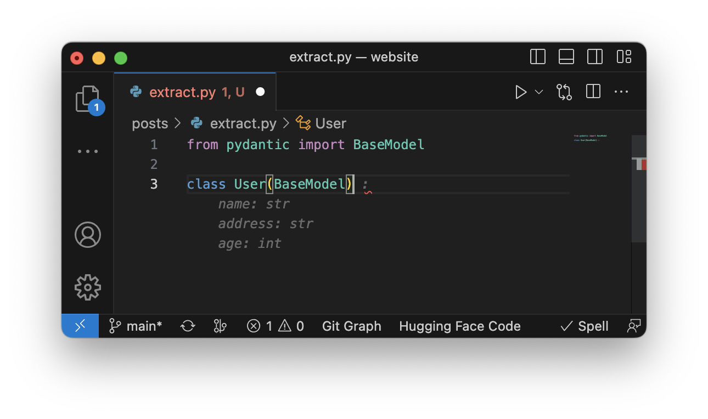
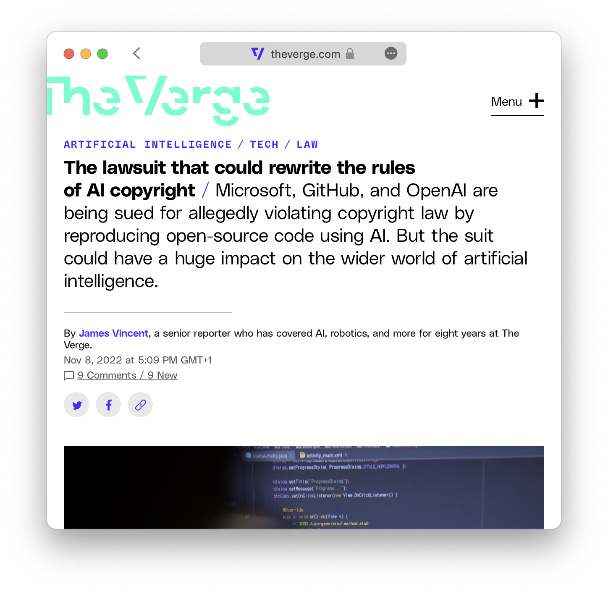

Code completion tools based on large language models (LLMs) are gaining a lot of momentum these days, one of the most popular being [GitHub Copilot](https://github.com/features/copilot). If you are work in software engineering field you have probably heard of or even used it.

Copilot utilizes [OpenAI Codex](https://openai.com/blog/openai-codex) and is most used as a [VS Code extension](https://marketplace.visualstudio.com/items?itemName=GitHub.copilotvs), allowing you to generate code using LLM seamlessly in your text editor.

::: {.column-margin}
> Also available for Neovim, JetBrains IDEs & Visual Studio
:::

Until recently there was no capable open-access alternative. However competition as arrived and it is called [StarCoder](https://github.com/bigcode-project/starcoder/tree/main), a project by [Huggingface](https://huggingface.co) and [ServiceNow](https://servicenow.com/).

## StarCoder

The developers of StarCoder claim that it outperforms existing open Code completion LLMs on popular programming benchmarks and matches or surpasses closed models such as [code-cushman-001](https://platform.openai.com/docs/models/codex) from [OpenAI](https://openai.com). They [claim](https://huggingface.co/blog/starcoder) that it is the most responsibly developed and strongest‑performing open‑access large language model (LLM) for code generation.

::: {.column-margin}
> `code-cushman-001` is the original Codex model powering early versions of Copilot
:::

### StarCoder Extension in VS Code

So I installed the StarCoder [extension](https://marketplace.visualstudio.com/items?itemName=HuggingFace.huggingface-vscode) and took it for a spin. StarCoder start suggesting completions as soon as you start typing. Highlighting suggestions in the same way as Copilot. The users can accept the whole suggestion or only accept the next suggested word.

This works quite well and delivers what I consider an up to par feature set. As soon as you have started to typing `StarCoder` starts suggesting complete functions.

As I expected StarCoder performs worse than the current version of Copilot. However, I had a great first experience with StarCoder in it's Proof of Concept stage. Most of the time it creates codes that resembles something I wanted to write myself.

{width=500 fig-align="center"}

Sometimes it's write incomplete lines of codes that therefore are invalid. And most of the time it is not as fast as Copilot.

However I think the team made a great tool even more if you take into account that the tool is free for everybody to use.

### Addressing Potential Issues

There are several [controversies](https://www.theverge.com/2022/11/8/23446821/microsoft-openai-github-copilot-class-action-lawsuit-ai-copyright-violation-training-data) surrounding Copilot. Some claim that its use may breach the contract with GitHub's users, while others argue that sharing PII (personally identifiable information) could violate privacy under the CCPA or GDPR.

{width=500 fig-align="center"}

> GitHub acknowledges that a small percentage of Copilot's output may be directly copied, raising concerns about whether the resulting code is transformative enough to qualify as fair use and whether it might infringe on the copyright of the original code owner.

The StarCoder model, in contrast, was trained on a limited portion of [The Stack 1.2 dataset](https://huggingface.co/datasets/bigcode/the-stack), which exclusively comprises code that is licensed permissively. The dataset also offers contributors the option to opt out and [remove their data](https://huggingface.co/spaces/bigcode/in-the-stack) from it.

The development team has made significant efforts to ensure the safe release of an open model. This includes an enhanced PII (personally identifiable information) redaction pipeline, a novel tool for attribution tracing, and the decision to make StarCoder available to the public under an improved version of the **OpenRAIL license**.

## Conclusion

GitHub Copilot is a well-known tool that uses OpenAI Codex to generate code using AI, which is available as a VS Code extension. It suggests code and entire functions in real-time.

StarCoder is an alternative to Copilot developed by Huggingface and ServiceNow. Although StarCoder performs worse than the current version of Copilot, I see a bright future ahead.
